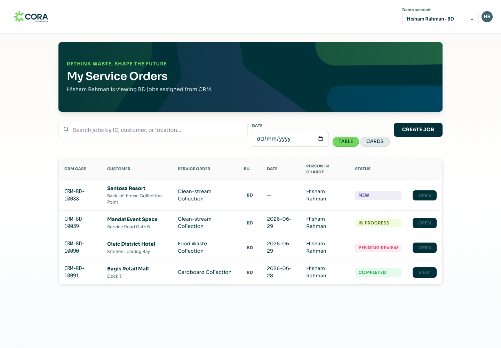
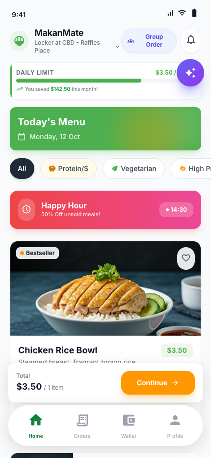

# Hi, I'm Afreed Ahmad

I build web apps, AI tools, and software that makes everyday workflows easier — from procurement approvals and field service orders to food discovery and personal productivity.

**Currently working on:** procurement workflows, digital service orders, and spend analytics.  
**Also exploring:** AI assistants, desktop productivity tools, and developer automation.

## Tech stack

Technologies I've used across my projects:

| Area | Tools |
| --- | --- |
| Languages | TypeScript, JavaScript, Python, Java, SQL, HTML, CSS |
| Web & UI | React, Next.js, Vite, Tailwind CSS, shadcn/ui, Radix UI, Motion |
| Mobile & desktop | React Native, Expo, Electron |
| Backend & data | Node.js, Express, FastAPI, Convex, Prisma, PostgreSQL, MySQL, SQLite, Supabase |
| AI & automation | Gemini, Vertex AI, Vercel AI SDK, RAG, Tesseract.js OCR |
| Microsoft ecosystem | Power Apps Code Apps, SharePoint, Power Automate, Microsoft Entra ID, Microsoft Graph |
| Cloud & tooling | Vercel, Google Cloud, AWS S3, Docker, GitHub Actions, pnpm, Turborepo |
| Testing | Vitest, Playwright, Jest, Testing Library, pytest, Supertest |

## Public projects

### [NeoCRM DSO](https://github.com/afreedy/neocrm-dso-backend)

A service-order prototype with a React frontend and mock CRM backend. Supports assigned jobs, business-unit-specific forms, proof of work, validation, and simulated completion updates.

**Built with:** TypeScript, React, Vite, Node.js, Express, Zod, Vitest.  
**Status:** runnable prototype with in-memory demo data.

### [Service Order Wizard](https://github.com/afreedy/service-order-wizard-form)

A guided service-order app for field users: customer and assignment details, signatures, before-and-after photos, and scale-photo OCR. Integrates with SharePoint through Power Apps Code Apps and includes reference-data administration.

**Built with:** TypeScript, React, Vite, Power Apps, SharePoint, Tesseract.js.

### [MakanMate](https://github.com/afreedy/MakanMate-SIP)

A mobile-first food discovery and ordering interface with an interactive map, menus, order flows, wallet screens, and pickup tickets.

**Built with:** TypeScript, React, Vite, React Router, Leaflet.  
**Status:** frontend prototype.

*Screenshots captured from local runs of the public repositories using their demo content.*

## More projects

These repositories are private; the summaries below describe the work at a high level.

| Project | What I'm building | Stack |
| --- | --- | --- |
| **ePR Standalone** | Purchase and blanket-purchase requests, approval routing, procurement queues, audit history, attachments, email notifications, and workflow analytics. | Next.js, React, TypeScript, Prisma, PostgreSQL, Auth.js, Entra ID, Microsoft Graph, S3 |
| **Supplier Spend Dashboard** | A spend-analysis proof of concept with filters, charts, tables, workbook processing, and PDF export. | Next.js, React, TypeScript, Python |
| **Digital SO** | A driver-facing service-order app for collection details, waste entries, photos, receipts, and signatures, alongside service-order planning work. | React, TypeScript, Vite, Power Apps, SharePoint |
| **Cue** | A voice-first AI CRM with a canvas workspace, semantic search, communication integrations, and web and mobile clients. | Next.js, React Native, Expo, Convex, Gemini, tldraw, Upstash Redis, Twilio, Postmark |
| **Chronos** | A productivity tracker combining desktop and browser activity with AI summaries and insights. | Electron, React, Python, FastAPI, SQLAlchemy, SQLite, Supabase, Gemini |
| **Chrysalis AI** | A developer-tool prototype for AI-assisted code migrations, with analysis, planning, and refactoring stages. | JavaScript, Node.js, Vertex AI, Google Cloud Pub/Sub, Docker, Octokit |
| **React Portfolio** | A personal portfolio site. | React, JavaScript, Vite, Tailwind CSS |

## Coursework & foundations

| Project | Focus | Stack |
| --- | --- | --- |
| **Silver Care SG** | A Java web application for care services, with booking, payment, authentication, and administration features. | Java 17, Jakarta Servlets, JSP, Tomcat, MySQL, Maven |
| **Dynamo — CI/CD coursework** | Team web-app coursework covering authentication, calendar features, database migrations, automated testing, and CI pipelines. | JavaScript, Express, Prisma, PostgreSQL, Docker, GitHub Actions, Jest, Playwright |
| **Island Furniture — SEP** | Furniture web-app coursework with backend services and a database-backed storefront. | JavaScript, Express, MySQL, HTML, CSS |
| **Security audit assignment** | Security testing and vulnerability-assessment work on a school application. | JavaScript, security testing |

Earlier practice includes backend-development labs, Git exercises, and [GitHub fundamentals](https://github.com/afreedy/skills-introduction-to-github). Related planning repositories and test repositories are grouped with their main projects above.
