# Hi, I'm Afreed Ahmad

I build business software that connects office decisions with work on the ground. My focus is procurement and field operations: turning paper forms, approval chains, and disconnected updates into usable applications.

## Personal apps

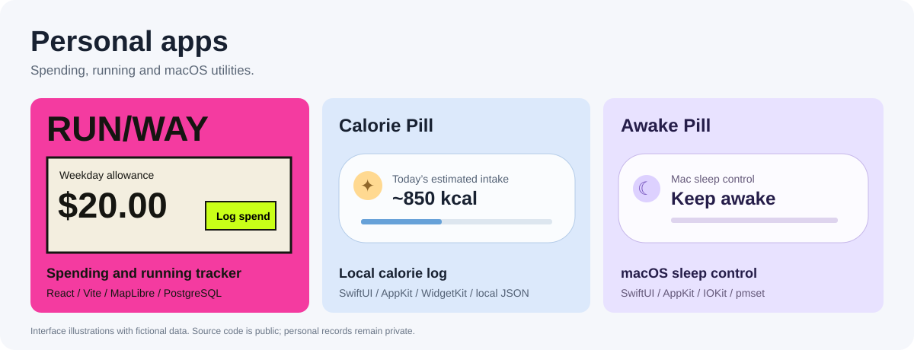

| App | What it does | Source |
| --- | --- | --- |
| **RUN/WAY** | Personal spending plans, manual expense logging, authenticated ChatGPT spending checks and a foreground GPS run tracker. | [Explore repository](https://github.com/afreedy/runway) |
| **Calorie Pill** | A floating macOS calorie display, local meal log, CLI and desktop widget. Food values are estimates. | [Explore repository](https://github.com/afreedy/calorie-pill) |
| **Awake Pill** | A native macOS sleep-control pill with kernel-state checks and optional startup configuration. | [Explore repository](https://github.com/afreedy/awake-pill) |

These illustrations use fictional values. The Mac apps run locally; credentials and personal meals, spending records and GPS history are excluded from the repositories.

## GitHub activity

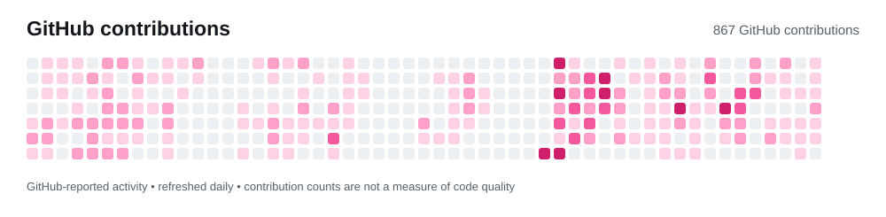

The calendar reads GitHub’s contribution data and refreshes with GitHub Actions. It shows activity, not project quality or hours worked.

## Featured work

### DSO — From paper service orders to connected field operations

I led development of the DSO application during my internship at Cora Environment, working with business stakeholders from discovery and workflow mapping through demonstrations, UAT, and training. The platform connects office scheduling and review with the drivers and technicians carrying out the work.

One role-aware PWA supports office and field users across business units. It brings together job assignment, GPS events, offline recovery, photographs, signatures, configurable forms, QR/PIN access, and multilingual interfaces. NeoCRM integration runs through a separate API aggregator, developed by another engineer.

**Engineering focus:** preserving field progress when connectivity drops, separating approved work from background delivery failures, and keeping a traceable completion record. PDF generation, customer email, and CRM delivery have their own processing states.

**Stack:** Next.js · React · TypeScript · NestJS · PostgreSQL · Prisma · BullMQ · Redis · next-intl · IndexedDB · AWS S3 / Textract · Microsoft Entra ID / Graph

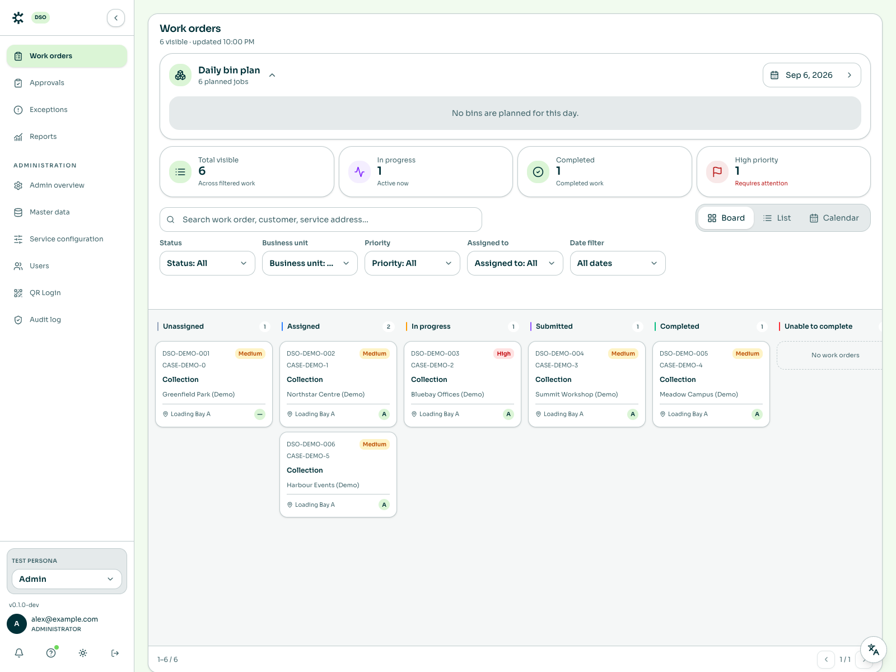

See the mobile field queue and operations reporting

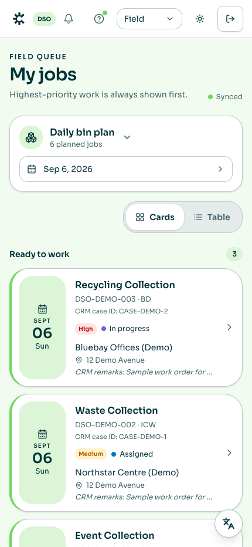
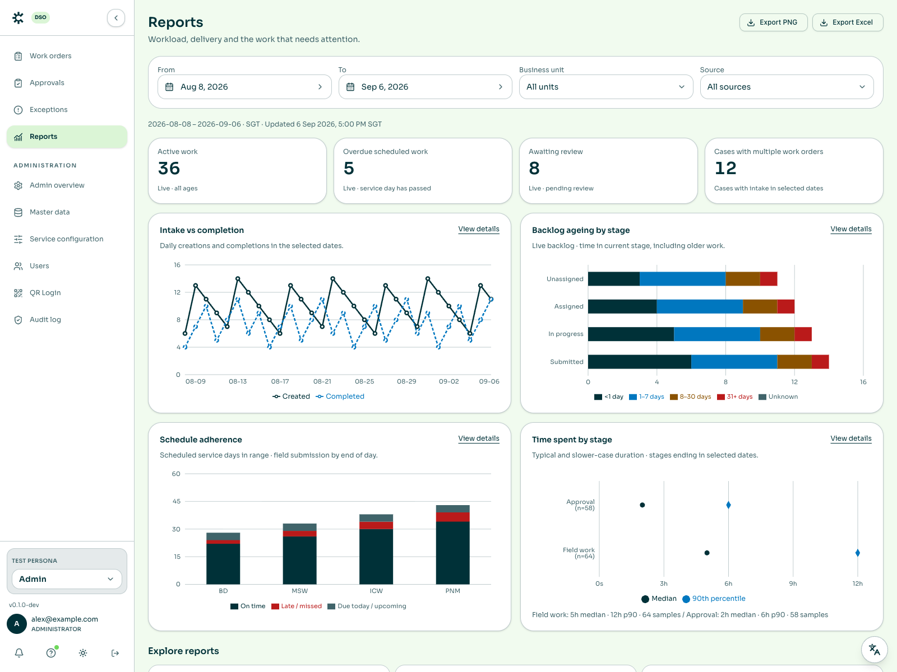

*Local preview from the latest main branch with synthetic operations data. Dashboard figures illustrate the interface; they are not company results.*

### ePR — Procurement from request to approval

An electronic purchase-request platform covering standard and blanket requests, configurable approval routing, procurement queues, attachments, and audit history. Dashboards bring spend, outstanding approvals, and process health into one view; Microsoft identity and email integrations connect the workflow to the workplace.

**Engineering focus:** approval state transitions, role-based access, traceability, and reliable notifications.

**Stack:** Next.js · React · TypeScript · Tailwind CSS · Prisma · PostgreSQL · Auth.js · Microsoft Entra ID · Microsoft Graph · AWS S3

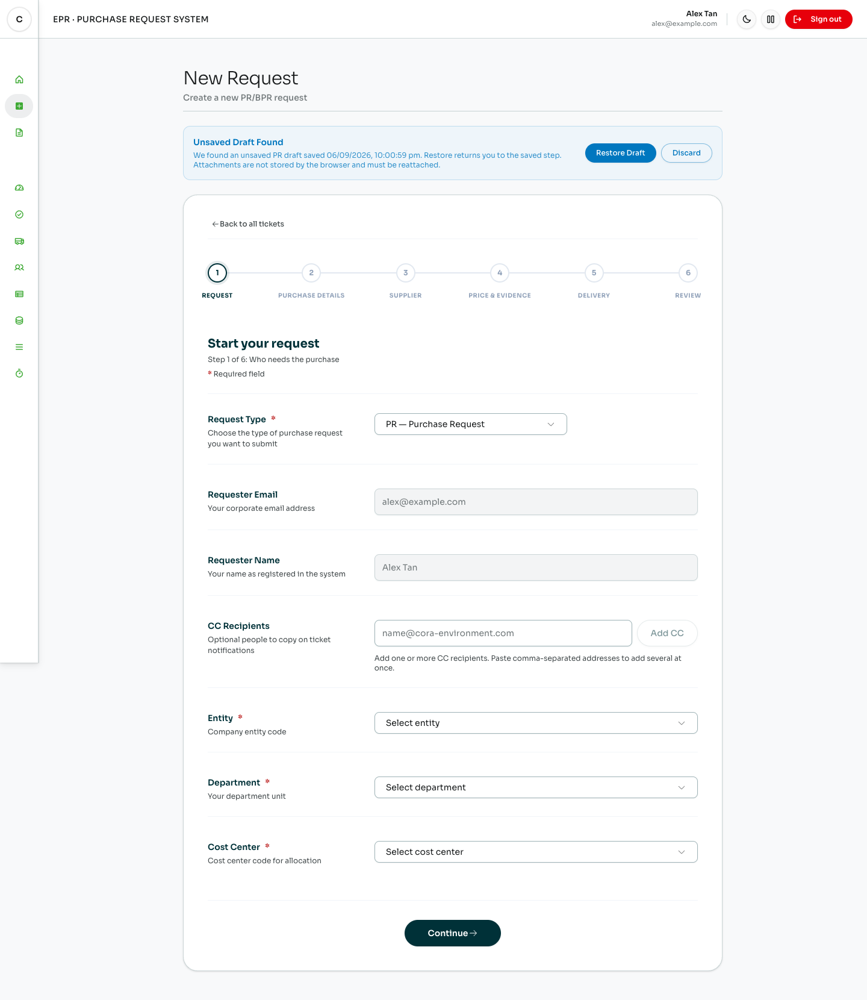

See the approval queue and procurement dashboard

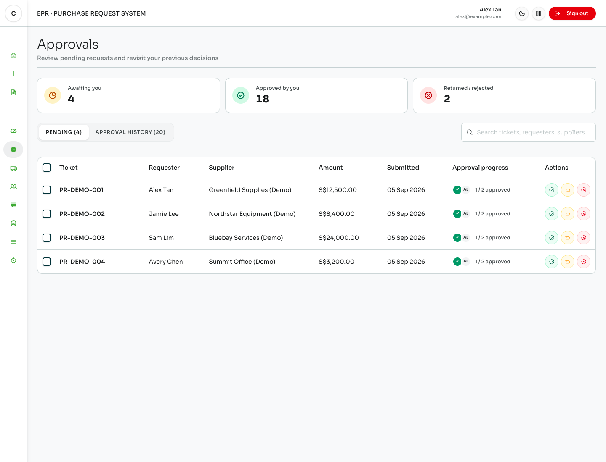
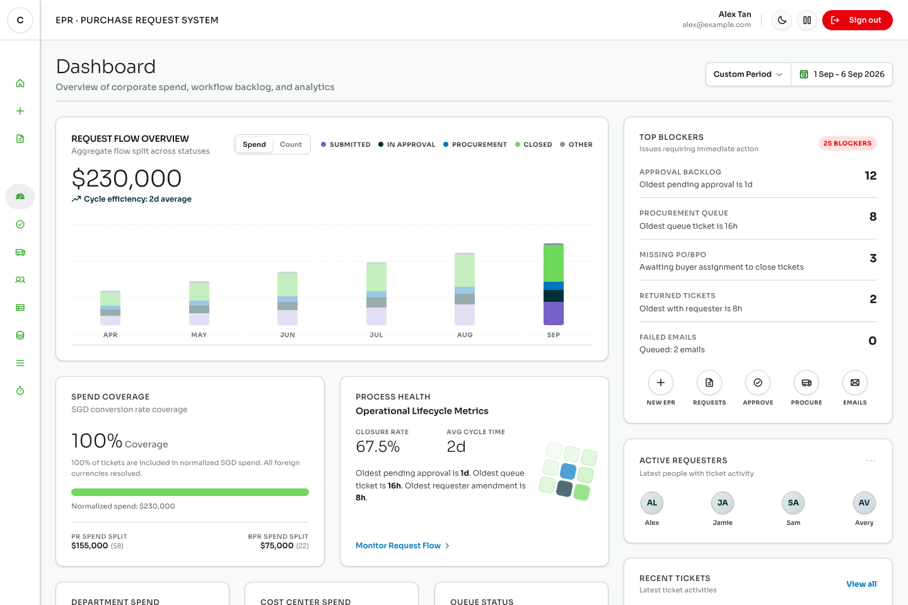

*Request creation, approval review, and spend visibility — shown with sample data.*

### [Digital SO — Guided service-order capture](https://github.com/afreedy/service-order-wizard-form)

A Power Apps Code App that guides field users through five steps: basic details, customer selection, driver and vehicle assignment, proof, and review. It combines customer hierarchies, waste entries, signatures, and before-and-after photos with SharePoint records and queued media uploads.

**Engineering focus:** offline drafts and submission recovery, compressed photo evidence, and OCR-assisted tonnage that users confirm before it is applied. The app also supports ad hoc customers and reference-data administration.

**Stack:** React · TypeScript · Vite · Power Apps Code Apps · SharePoint · Tesseract.js · IndexedDB

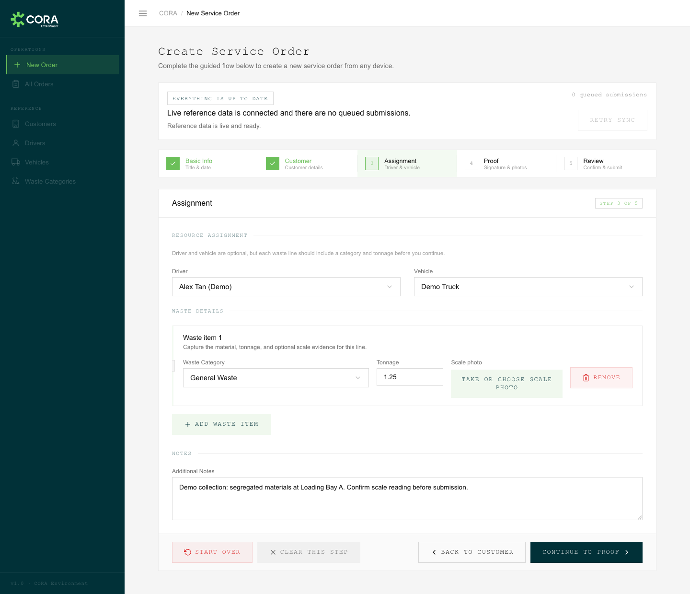

See customer selection and signature capture

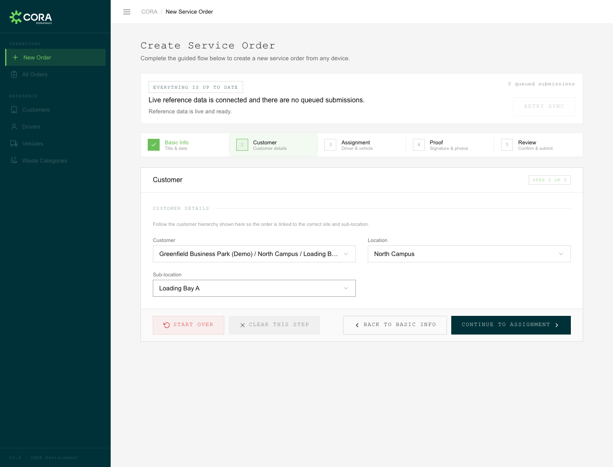
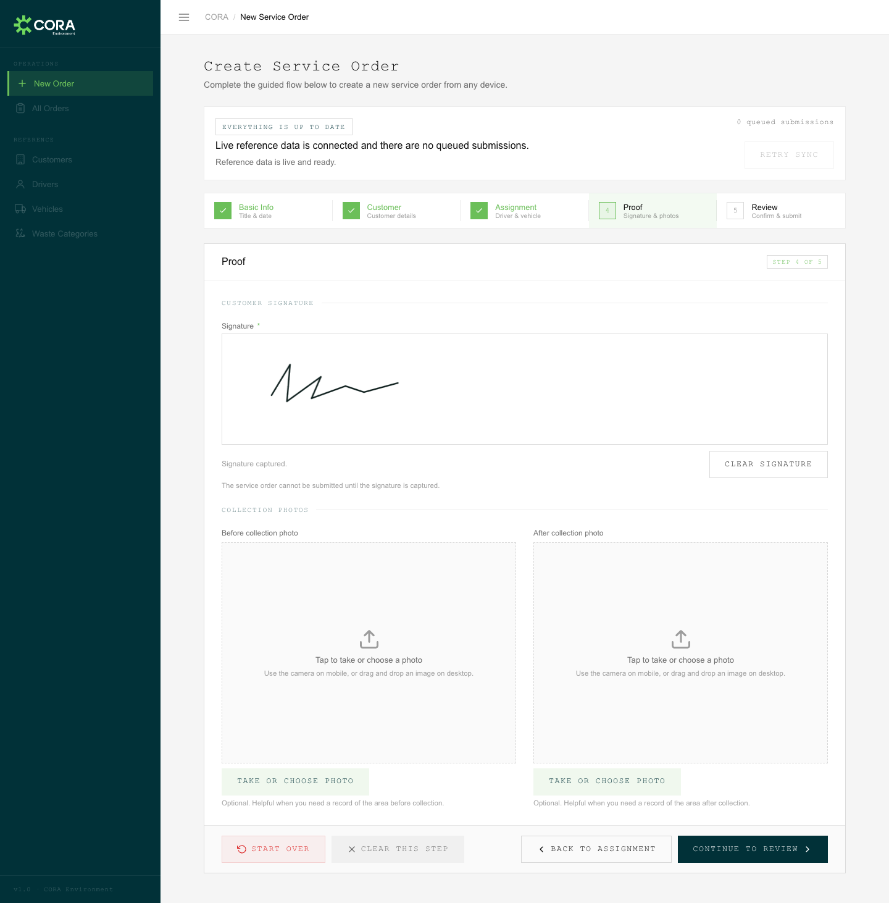

*Customer selection, assignment and tonnage, and proof capture in the service-order-form app. All records and the signature are synthetic.*

## Core tech stack

| Area | Technologies |
| --- | --- |
| Application development | TypeScript, React, Next.js, NestJS, Node.js, Vite |
| Interfaces | Tailwind CSS, shadcn/ui, Radix UI, responsive PWAs, next-intl |
| Data & background processing | PostgreSQL, Prisma, Redis, BullMQ, transactional outbox |
| Identity & workplace integration | Microsoft Entra ID, Auth.js, Microsoft Graph, Power Apps, SharePoint, Power Automate |
| Field capabilities | IndexedDB, offline synchronisation, GPS, signatures, QR/PIN, OCR |
| Infrastructure & delivery | AWS S3, Textract, Docker, pnpm, GitHub Actions |
| Quality | Vitest, Jest, Playwright, Testing Library, Zod |

ePR and DSO source code is private; Digital SO’s public repository is linked above. All screenshots show local application interfaces with synthetic data. API and connector responses are replaced with demo fixtures for these previews.

<strong>More projects and earlier work</strong>

### [NeoCRM DSO](https://github.com/afreedy/neocrm-dso-backend)

A service-order prototype with a React frontend and mock CRM backend. Supports assigned jobs, business-unit-specific forms, proof of work, validation, and simulated completion updates.

**Built with:** TypeScript, React, Vite, Node.js, Express, Zod, Vitest.

**Status:** runnable prototype with in-memory demo data.

### [MakanMate](https://github.com/afreedy/MakanMate-SIP)

A mobile-first food discovery and ordering interface with an interactive map, menus, order flows, wallet screens, and pickup tickets.

**Built with:** TypeScript, React, Vite, React Router, Leaflet.

**Status:** frontend prototype.

### Other private projects

| Project | What I’m building | Stack |
| --- | --- | --- |
| **Supplier Spend Dashboard** | A spend-analysis proof of concept with filters, charts, tables, workbook processing, and PDF export. | Next.js, React, TypeScript, Python |
| **Cue** | A voice-first AI CRM with a canvas workspace, semantic search, communication integrations, and web and mobile clients. | Next.js, React Native, Expo, Convex, Gemini, tldraw, Upstash Redis, Twilio, Postmark |
| **Chronos** | A productivity tracker combining desktop and browser activity with AI summaries and insights. | Electron, React, Python, FastAPI, SQLAlchemy, SQLite, Supabase, Gemini |
| **Chrysalis AI** | A developer-tool prototype for AI-assisted code migrations, with analysis, planning, and refactoring stages. | JavaScript, Node.js, Vertex AI, Google Cloud Pub/Sub, Docker, Octokit |
| **React Portfolio** | A personal portfolio site. | React, JavaScript, Vite, Tailwind CSS |

## Coursework & foundations

| Project | Focus | Stack |
| --- | --- | --- |
| **Silver Care SG** | A Java web application for care services, with booking, payment, authentication, and administration features. | Java 17, Jakarta Servlets, JSP, Tomcat, MySQL, Maven |
| **Dynamo — CI/CD coursework** | Team web-app coursework covering authentication, calendar features, database migrations, automated testing, and CI pipelines. | JavaScript, Express, Prisma, PostgreSQL, Docker, GitHub Actions, Jest, Playwright |
| **Island Furniture — SEP** | Furniture web-app coursework with backend services and a database-backed storefront. | JavaScript, Express, MySQL, HTML, CSS |
| **Security audit assignment** | Security testing and vulnerability-assessment work on a school application. | JavaScript, security testing |

Earlier practice includes backend-development labs, Git exercises, and [GitHub fundamentals](https://github.com/afreedy/skills-introduction-to-github). Related planning repositories and test repositories are grouped with their main projects above.

Other tools used across these projects include Python, Java, Express, FastAPI, Convex, MySQL, SQLite, Supabase, Electron, React Native, Expo, Gemini, and Vertex AI.

